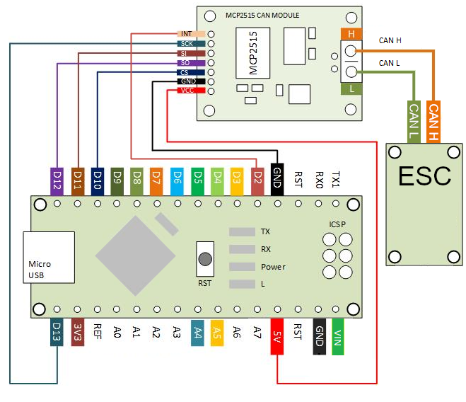
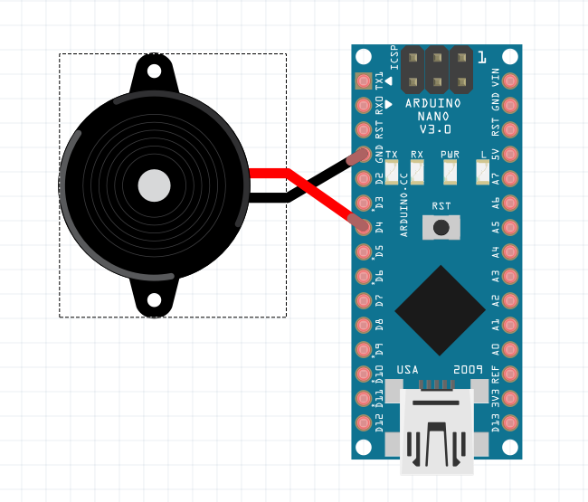
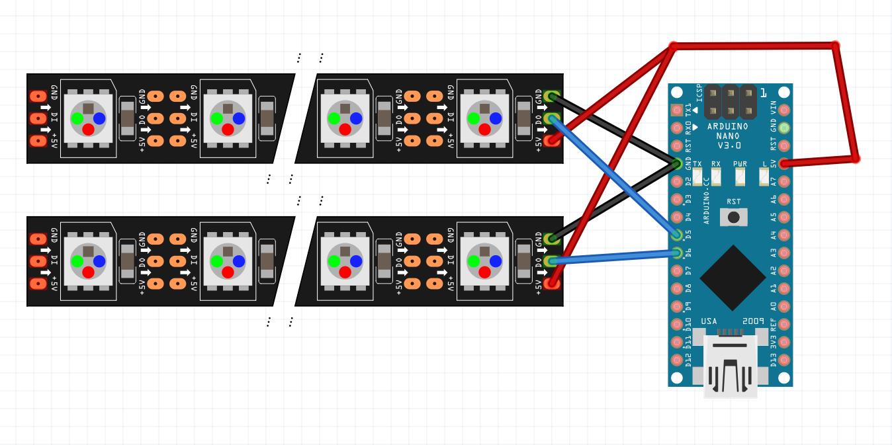
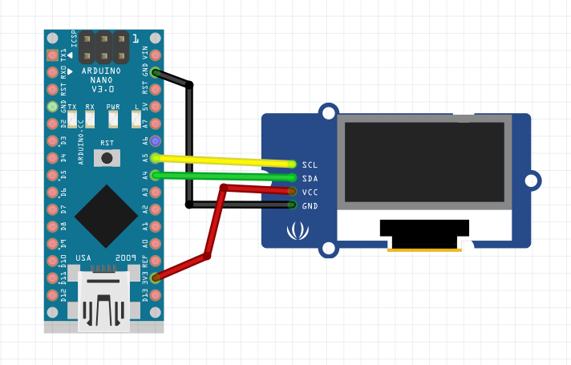

# Balance Buddy
Arduino based accessory board for the balance app in BV's BLDC firmware.

## Features
1. Directional LEDs for headlight/taillight.
1. Buzzer for over speed, low voltage, and high speed half switch warnings.
1. A teeny tiny small display thats so small you cant even see it with data you probbaly wont be able to read (it's smol).
1. It uses CAN bus, so there are NO DOWNSIDES to adding it. JUST DO IT!

## Parts List
1. Adruino Nano
1. MCP2515 Can Bus Module Board
1. 5v piezo buzzer
1. 2x LED Strips (WS2811 GRB is the default, but anything supported by FastLED should work)
1. SSD1306 128x64 Display

# Wiring
## Can Module: 
For more info see https://github.com/autowp/arduino-mcp2515

### 2. Piezo:
**if you use a fancy buzzer/speaker make sure it wont blow the nano**

### 3. LEDs:
**if you wire lots of LEDs make sure it wont blow the nano**

### 4. SSD1306:

# Configuration
## Options and pins
Features are designed to be configured VIA the constants
1. esc.cpp: Configure CAN bus IDs, you must match the ID set in the VESC Tool
1. balance_beeper.cpp: Configure wiring and alerts
1. balance_leds.cpp: Configure wiritng, LED Type, Brightnes, etc.
1. balance_display.cpp: Nothing configureable yet

## Building
All the required libraries are included, just hit build in Arduino IDE
